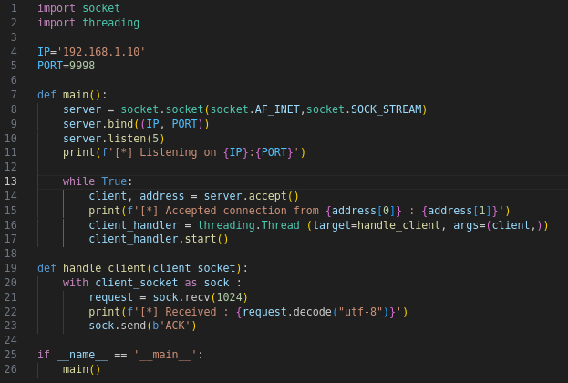
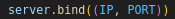
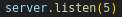
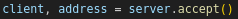
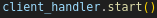
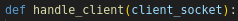
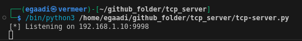

# Server TCP

## penjelasan:    
Server TCP ini akan berguna untuk menulis command shell atau membuat proxy.

Untuk memulai, kita masukkan alamat IP dan port yang diinginkan agar server mendengarkan.  

  

Selanjutnya, kita beri tahu server untuk mulai mendengarkan, dengan jumlah koneksi maksimum yang ditetapkan adalah 5. 

  

Kami kemudian menempatkan server ke dalam loop utamanya, tempat server menunggu koneksi masuk. Ketika klien terhubung, kami menerima soket klien dalam variabel client dan detail koneksi jarak jauh dalam variabel address. 

  

Kami kemudian membuat objek thread baru yang menunjuk ke fungsi handle_client kami, dan kami berikan objek soket klien sebagai argumen. Kami kemudian memulai thread untuk menangani koneksi klien,  

 

di mana loop server utama siap menangani koneksi masuk lainnya. Fungsi handle_client menjalankan recv() dan kemudian mengirimkan pesan sederhana kembali ke klien.

 

Anda akan melihat output-nya sebagai berikut:

